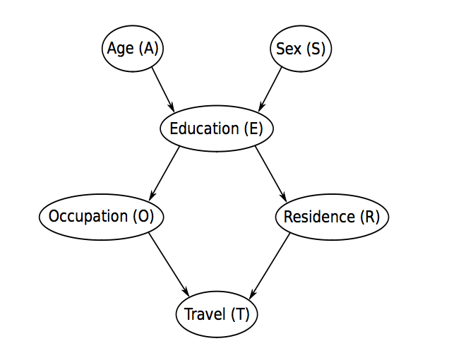

```{r}
options(digits = 3)
```

# Aprendizaje Paramétrico 

## Estimacion de máxima verosimilitud MLE y Bayes de la distribucion de probabilidad

Determina las CPTs del grafo utilizando los datos de la encuesta recogida en `survey.txt` y el método de máxima verosimilitud (MLE). Comprueba si la CPT del nodo O obtenida por MLE coincide con la experimental obtenida directamente de los datos. 

```{r}
library(bnlearn)
dag<-model2network("[A][S][E|A:S][O|E][R|E][T|O:R]")
graphviz.plot(dag)
survey<-read.table("survey.txt", header=TRUE, stringsAsFactors = T)
bn_mle<-bn.fit(dag, data=survey,method="mle") # aprendzaje paramétrixo por máxima
# verosimilitud
NOE<-xtabs(~O+E, data=survey)
prop.table(NOE, margin=2)
bn_mle$O
```

## Estimacion Bayesiana de la distribucion de probabilidad

Determina las CPTs del grafo utilizando los datos de la encuesta recogida en `survey.txt` y el método Bayesiano. Comprueba si la CPT del nodo O obtenida por Bayes coincide con la experimental obtenida directamente de los datos. Fija el valor de `iss=10`.

```{r}
bn_bayes<-bn.fit(dag, data=survey,method="bayes",iss=100000) 
bn_mle$O
bn_bayes$O
```

Para comprobar el efecto del `imaginary sample size` y determina como varía la estimación de `Pr(O=self|E=uni)` cuando `iss<-10^seq(0, 4, by = 0.1)`

```{r}
p.O.self.E.uni<-vector()
p.O.emp.E.uni<-vector()
iss<-10^seq(0, 4, by = 0.1) 

```

# Aprendizaje estructural

## Pruebas de independencia condicional

Comprueba si existe Independencia condicional $Height \bot Diameter|Species$ utilizando `ci.test`. 

```{r}
# load the data.
data(lizards)

# H0 independencia condicional
ci.test(x="Height",y="Diameter", z="Species", data=lizards)
```

Comprueba si existe independencia `ci.test` entre nodos del grafo que se indican...



```{r}
dag<-model2network("[A][S][E|A:S][O|E][R|E][T|O:R]")
graphviz.plot(dag, shape = "ellipse")

# S,E
ci.test(x="E",y="S", data=survey) # dependencia

# A,S
ci.test(x="A",y="S", data=survey) # independencia

#A,E
ci.test(x="A",y="E", data=survey) # son dependientes

#A,S|E
ci.test(x="A",y="S", z="E", data=survey) # independencia

#T,E
ci.test(x="T",y="E", data=survey) # independencia

#T,R
ci.test(x="T",y="R", data=survey) # dependencia

#T,O,R
ci.test(x="O",y="O" ,data=survey) # NO ESTÁ BIEN Y NO SÉ CÓMO PONERLO

```

## Fuerza de las conexiones del grafo

Comprueba la fuerza de las conexiones del grafo con `arc.strength`

```{r}
dag<-model2network("[A][S][E|A:S][O|E][R|E][T|O:R]")
arc.strng<-arc.strength(dag, data=survey, criterios="x2")
arc.strng[order(-arc.strng$strength),]
```


## Bondad del ajuste 

Determina el score obtenido por el grafo para el conjunto de datos de la encuesta para los diferentes criterios `bic`, `bde` 

```{r}
library(bnlearn)
dag<-model2network("[A][S][E|A:S][O|E][R|E][T|O:R]")
bnlearn::score(dag, data = survey, type = "bic")#Bayesian Information criterion (BIC)


```

Comprueba que un grafo aleatorio siempre tiene menos Score que el grafo original. 

```{r}
rnd <- random.graph(nodes = c("A", "S", "E", "O", "R", "T"))
modelstring(rnd)

```

Comprueba que añadir un arco E->T `set.arc` al grafo también tiene menos Score que el grafo original. 

```{r}
dag<-model2network("[A][S][E|A:S][O|E][R|E][T|O:R]")

```


## Algoritmos basado en restricciones (constraint-based structure learning algorithms)


Búsqueda de V-estructuras mediante pruebas de independencia condicionada. El resultado depende basicamente del test de independencia elegido (basado en la teoría de información o en la estadística clásica).

`Learn the equivalence class of a directed acyclic graph (DAG) from data using the Grow-Shrink (GS), the Incremental Association (IAMB), the Fast Incremental Association (Fast-IAMB), the Interleaved Incremental Association (Inter-IAMB), the Max-Min Parents and Children (MMPC) or the Semi-Interleaved HITON-PC constraint-based algorithms.`


```{r}
dag<-model2network("[A][S][E|A:S][O|E][R|E][T|O:R]")
data<-survey
#Grow-Shrink (GS)
bn.gs<-gs(data, test="mi",debug=F)
graphviz.plot(bn.gs)
```


## Aprendizaje estructural (score-based structure learning algorithms)


```{r}
library(bnlearn)
set.seed(666)
dag<-model2network("[A][S][E|A:S][O|E][R|E][T|O:R]")
data<-survey
graph.gs <- gs(data,test='mi',debug=F, alpha=0.1)
library(Rgraphviz)
graphviz.plot(graph.gs)
directed(graph.gs)
acyclic(graph.gs)

dag.gs <- pdag2dag(graph.gs,ordering=c('A','S','E','O','R','T'))
```

Aprendizaje con información apriori. Fuerza los arcos A->E y S->E mediante `whitelist`. 

```{r}

```


## Aprendizaje estructural (hybrid structure learning algorithms)


```{r}
library(bnlearn)
library(gRain)

#2-phase Restricted Maximization (RSMAX2) hybrid algorithms.

```
