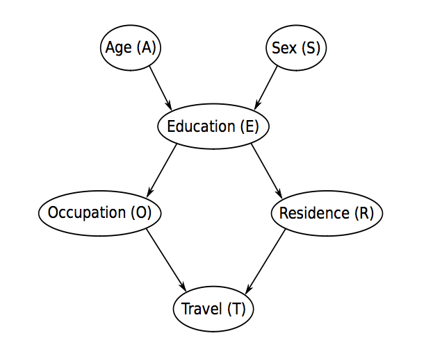
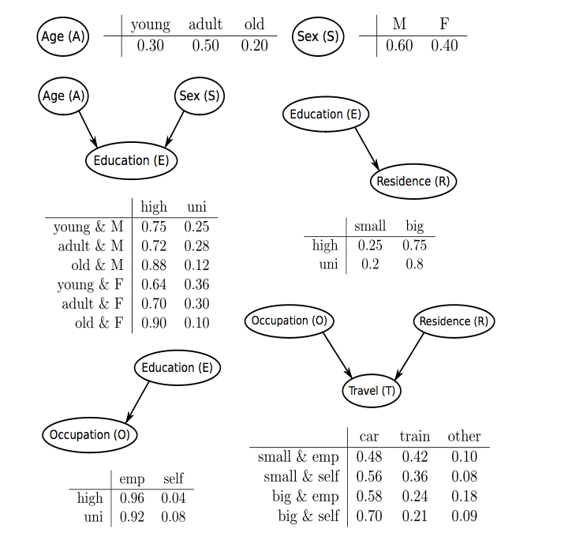

# Probabilidad

Utilizando la instrucción `sample` de R, generaremos 10000 valores de una variable aleatoria X que adquiera los valores {A,B,C,D} siguiendo la proporción A = 10% B = 20% C = 65% D = 5%. Comprueba si la distribución de probabilidad coincide con la esperada. Realiza el mismo experimento utilizando la funcion `rmultinom`.

```{r}
LETTERS[1:4]
n<-100
X<-sample(LETTERS[1:4],n,replace = TRUE,prob = c(0.1,0.2,0.65,0.05))
prop.table(table(X))

X.rmultinom<-rmultinom(n=1,size=n,prob = c(0.1,0.2,0.65,0.05))

```

Utiliza la función `dmultinom` para obtener la probabilidad P(x) de encontrar una: - letra C - dos letras C - una letra de cada

```{r}
p<-c(0.1, 0.2, 0.65, 0.05)
x<-c(0,0,1,0)
y<-c(0,0,2,0)
z<-c(1,1,1,1)

p1C <- dmultinom(x,prob=p)
p2C <- dmultinom(y,prob=p)
p2C <- dmultinom(z,prob=p)

```

Utilizando la funcion `rmultinom` genera 100 casos de las variables aleatorias $A=\{on,off\}$ y $B=\{up,down\}$ de las que sigan la distribución probabilidad conjunta $P(A,B)$ siguiente:

| P(A,B) | B=up                 | B=down              |
|--------|----------------------|---------------------|
| A=on   | 0.05263158 (010/190) | 0.1578947 (030/190) |
| A=off  | 0.52631579 (100/190) | 0.2631579 (050/190) |

Comprueba cuánto se aproxima la muestra generada a la distribución teórica utilizando `prop.test`.

```{r}
set.seed(666)
n<-c(10,100,30,50)
p<-n/sum(n)
X.rmultinom<-rmultinom(n=1,size=190,prob = n)
X.table <- matrix(X.rmultinom,nrow = 2,byrow=F,dimnames = list('A'=c('on','off'),'B'=c('up','down')))
prop.table(X.table)
prop.test(x=as.vector(X.rmultinom),n=rep(190,4),p=p)
```

Determina la densidad de probabilidad conjunta `P(O,E) del data.frame`survey\` (el conjunto de datos trata sobre encuestas de transporte). Determina también P(O\|E).

```{r}
survey <- read.table("survey.txt", header = TRUE)
names(survey)
NOE <- xtabs(~E+O,data=survey)
# P(O,E)
POE <- prop.table(NOE) # estimacion por maxima verosimilitud de la distribucion conjunta
PO_E <- prop.table(NOE,margin=1) # margin en prop table indica la variable que condiciona
```

Estima la densidad de probabilidad conjunta del conjunto de datos `lizardRAW` (este conjunto de datos estudia las características de las `lizards`).

```{r}
#In a study of lizard behaviour, characteristics of 409 lizards were recorded, namely species (S), perch diameter (D) and perch height (H).
library(gRain)
data(lizardRAW)
#library(bnlearn)
summary(lizardRAW)
names(lizardRAW)<-c("D","H","S")

NDHS <- xtabs(~D+H+S,data=lizardRAW)
PDHS <- prop.table(NDHS)
ftable(PDHS)
```

Marginaliza sobre D la distribución P(D,H,S) para obtener P(H,S)

```{r}
PHS<-margin.table(PDHS,margin=c(2,3))
PHS.data <- prop.table(xtabs(~ H+S,data=lizardRAW))
```

Determina si las variables H y S son independientes comprobando si se cumple P(H\|S)=P(H) o alternativamente P(H,S)=P(H)\*P(S)

```{r}

```

# Grafos acíclicos

Crearemos el grafo acíclico DAG con la instrucción `empty.graph` del paquete `bnlearn` que contenga los nodos c("A", "S", "E", "O", "R", "T")

```{r}
library(bnlearn)

dag <- empty.graph(nodes=c("A", "S", "E", "O", "R", "T"))
plot(dag)
```

## Arcos

Añade arcos `set.arc` al grafo hasta formar el siguiente DAG.



```{r}
dag <- set.arc(x=dag,from='A',to='E')
dag <- set.arc(x=dag,from='S',to='E')
dag <- set.arc(x=dag,from='E',to='O')
dag <- set.arc(x=dag,from='E',to='R')
dag <- set.arc(x=dag,from='O',to='T')
dag <- set.arc(x=dag,from='R',to='T')
#solucion
library(Rgraphviz)
graphviz.plot(dag,layout='dot')
```

## CPT (conditional) probability tables

Crearemos los niveles y las CPT asociadas a cada nodo (variable)siguiendo la siguiente figura.



## Nodo A

```{r}
A.lv <- c("young", "adult", "old")
A.prob <- array(c(0.30, 0.50, 0.20), dim = 3,dimnames = list(A = A.lv))
A.prob
```

# Nodo S

```{r}
S.lv <- c("M", "F")
S.prob <- array(c(0.6,0.4), dim = 2,dimnames = list(S = S.lv))
S.prob
```

## Nodo E

```{r}
E.lv <- c("high", "uni")
#P(E|A,S) # dim <- #dim(E)=2, dim(A)=3, dim(S)=2
E.prob <- array(c(0.75, 0.25, 0.72, 0.28, 0.88, 0.12, 0.64,
            0.36, 0.70, 0.30, 0.90, 0.10), dim = c(2, 3, 2),
            dimnames = list(E = E.lv, A = A.lv, S = S.lv))
#E.prob
ftable(E.prob,row.vars = c(3,2),col.vars = 1)
```

## Nodo O

```{r}
O.lv <- c("emp", "shelf")
O.prob <- array(c(0.96,0.04,0.92,0.08), dim = c(2,2),dimnames = list(O = O.lv,E=E.lv))
ftable(O.prob,col.vars=1)
```

## Nodo R

```{r}
R.lv <- c("small", "big")
R.prob <- array(c(0.25,0.75,0.2,0.8), dim = c(2,2),dimnames = list(R = R.lv,E=E.lv))
R.prob
```

## Nodo T

```{r}
T.lv <- c("car", "train", "other")
T.prob <- array(c(0.48, 0.42, 0.10, 0.56, 0.36, 0.08, 0.58,
            0.24, 0.18, 0.70, 0.21, 0.09), dim = c(3, 2, 2),
            dimnames = list(T = T.lv, O = O.lv, R = R.lv))
ftable(T.prob,row.vars = c(3,2),col.vars = 1)
```

Para asociar la distribuciones de probabilidad al grafo necesitamos, previamente, crear una lista (con los nombres de los nodos) que contenga todas las matrices de probabilidad asociado a cada nodo.

```{r}
cpt  <- list(A=A.prob,S=S.prob,E=E.prob,O=O.prob,R=R.prob,T=T.prob)
```

## Red Bayesiana

Unimos el grafo y las distribuciones locales para crear la red bayesiana con `custom.fit`

```{r}
bn <- custom.fit(dag,cpt)
bn
```

```{r}
class(bn$T$prob)
dimnames(bn$T$prob)
bn$T$prob['car',,]
```


